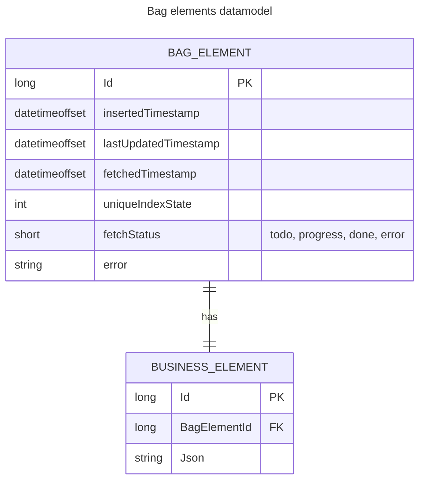

```mermaid
---
title: Bag elements datamodel
---
erDiagram
    BAG_ELEMENT ||--|| BUSINESS_ELEMENT : has
    BAG_ELEMENT {
        long Id PK
        datetimeoffset insertedTimestamp
        datetimeoffset lastUpdatedTimestamp
        datetimeoffset fetchedTimestamp
        int uniqueIndexState
        short fetchStatus "todo, progress, done, error"
        string error
    }
    BUSINESS_ELEMENT {
        long Id PK
        long BagElementId FK
        string Json
    }
```
