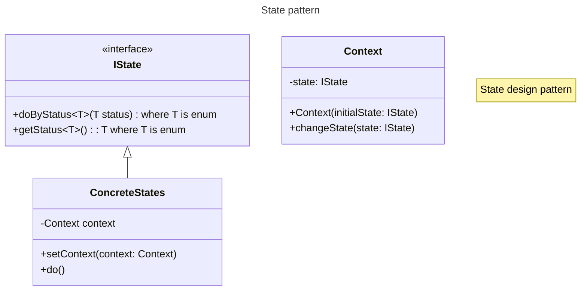

```mermaid
---
title: State pattern
---
classDiagram
    note "State design pattern"
    class IState{
        <<interface>>
        +doByStatus~T~(T status) where T is enum
        +getStatus~T~(): T where T is enum
    }
    class Context{
        -state: IState
        +Context(initialState: IState)
        +changeState(state: IState)
    }
    IState <|-- ConcreteStates
    class ConcreteStates{
        -Context context
        +setContext(context: Context)
        +do()
    }
```
