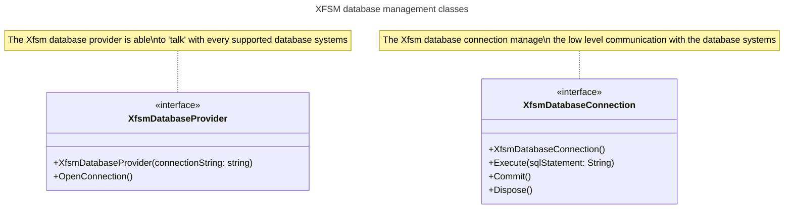

```mermaid
---
title: XFSM database management classes
---
classDiagram
    note for XfsmDatabaseProvider "The Xfsm database provider is able\nto 'talk' with every supported database systems"
    class XfsmDatabaseProvider{
        <<interface>>
        +XfsmDatabaseProvider(connectionString: string)
        +OpenConnection()
    }

    note for XfsmDatabaseConnection "The Xfsm database connection manage\n the low level communication with the database systems"
    class XfsmDatabaseConnection{
        <<interface>>
        +XfsmDatabaseConnection()
        +Execute(sqlStatement: String)
        +Commit()
        +Dispose()
    }

```

