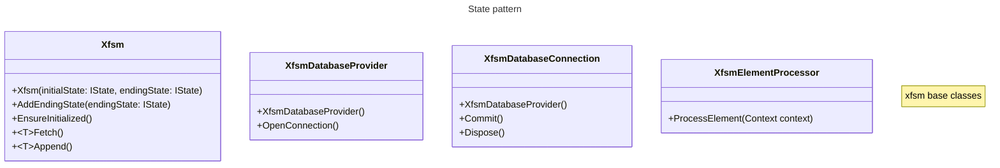

```mermaid
---
title: State pattern
---
classDiagram
    note "xfsm base classes"
    class Xfsm{
        +Xfsm(initialState: IState, endingState: IState)
        +AddEndingState(endingState: IState)
        +EnsureInitialized()
        +~T~Fetch()
        +~T~Append()
    }

    class XfsmDatabaseProvider{
        +XfsmDatabaseProvider()
        +OpenConnection()
    }

    class XfsmDatabaseConnection{
        +XfsmDatabaseProvider()
        +Commit()
        +Dispose()
    }

    class XfsmElementProcessor{
        +ProcessElement(Context context)
    }

```
