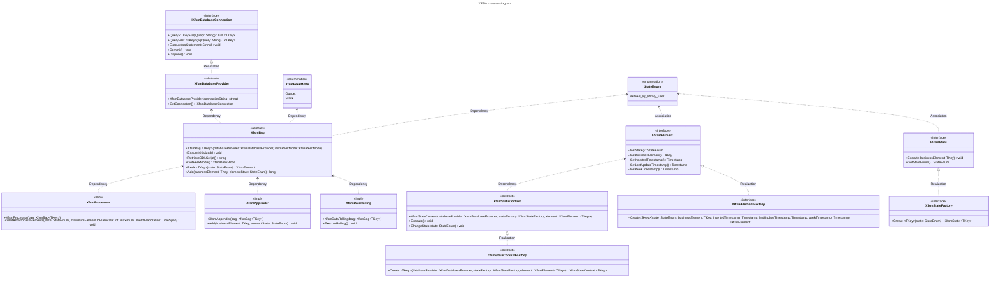

```mermaid
---
title: XFSM classes diagram
---
classDiagram
    IXfsmDatabaseConnection <|.. XfsmDatabaseProvider : Realization
    XfsmDatabaseProvider <.. XfsmBag : Dependency
    XfsmPeekMode <.. XfsmBag : Dependency
    StateEnum <.. XfsmBag : Dependency
    StateEnum <.. IXfsmElement : Association
    StateEnum <.. IXfsmState : Association
    IXfsmState <|.. IXfsmStateFactory : Realization
    IXfsmElement <.. XfsmStateContext: Dependency
    IXfsmElement <|.. IXfsmElementFactory : Realization
    XfsmStateContext <|.. XfsmStateContextFactory : Realization
    XfsmBag <.. XfsmProcessor : Dependency
    XfsmBag <.. XfsmAppender : Dependency
    XfsmBag <.. XfsmDataRolling : Dependency

    %% note for XfsmDatabaseProvider "The Xfsm database provider is able\nto 'talk' with every supported database systems"
    class XfsmDatabaseProvider{
        <<abstract>>
        +XfsmDatabaseProvider(connectionString: string)
        +GetConnection() IXfsmDatabaseConnection
    }

    %% note for IXfsmDatabaseConnection "The Xfsm database connection manage\n the low level communication with the database systems"
    class IXfsmDatabaseConnection{
        <<interface>>
        +Query ~TKey~(sqlQuery: String) List ~TKey~
        +QueryFirst ~TKey~(sqlQuery: String) ~TKey~
        +Execute(sqlStatement: String) void
        +Commit() void
        +Dispose() void
    }

    %% note for XfsmBag "The XfsmBag is used to initialize\n the bag data structure, peek and add new items"
    class XfsmBag ~TKey~ {
        <<abstract>>
        +XfsmBag ~TKey~(databaseProvider: XfsmDatabaseProvider, xfsmPeekMode: XfsmPeekMode)
        +EnsureInitialized() void
        +RetrieveDDLScript() string
        +GetPeekMode() XfsmPeekMode
        +Peek ~TKey~(state: StateEnum) XfsmElement
        +Add(businessElement: TKey, elementState: StateEnum) long
    }

    class XfsmPeekMode {
       <<enumeration>>
       Queue,
       Stack
    }

    class StateEnum {
       <<enumeration>>
       defined_by_library_user
    }

    %% note for IXfsmElement "XfsmElement represents a single specific element of the items collections"
    class IXfsmElement ~TKey~ {
        <<interface>>
        +GetState() StateEnum
        +GetBusinessElement() TKey
        +GetInsertedTimestamp() Timestamp
        +GetLastUpdateTimestamp() Timestamp
        +GetPeekTimestamp() Timestamp
    }

    %% note for IXfsmState "Represents a specific state of the FSM (the interface which the user has to implement)"
    class IXfsmState ~TKey~ {
        <<interface>>
        +Execute(businessElement: TKey) void
        +GetStateEnum() StateEnum
    }

    class IXfsmStateFactory {
        <<interface>>
        +Create ~TKey~(state: StateEnum) IXfsmState ~TKey~
    }

    class IXfsmElementFactory {
        <<interface>>
        +Create~TKey~(state: StateEnum, businessElement: TKey, insertedTimestamp: Timestamp, lastUpdateTimestamp: Timestamp, peekTimestamp: Timestamp) IXfsmElement
    }
    
    %% note for XfsmStateContext "Represents a specific state of the FSM (the interface which the user has to implement)"
    class XfsmStateContext ~TKey~ {
        <<abstract>>
        +XfsmStateContext(databaseProvider: XfsmDatabaseProvider, stateFactory: IXfsmStateFactory, element: IXfsmElement ~TKey~)
        +Execute() void
        +ChangeState(state: StateEnum) void
    }
    
    class XfsmStateContextFactory {
        <<abstract>>
        +Create ~TKey~(databaseProvider: XfsmDatabaseProvider, stateFactory: IXfsmStateFactory, element: IXfsmElement ~TKey~) XfsmStateContext ~TKey~
    }

    class XfsmProcessor ~TKey~ {
        <<impl>>
        +XfsmProcessor(bag:  XfsmBag~TKey~)
        +WaitAndProcessElements(state: StateEnum, maximumElementToElaborate: int, maximumTimeOfElaboration: TimeSpan) void
    }

    class XfsmAppender ~TKey~ {
        <<impl>>
        +XfsmAppender(bag:  XfsmBag~TKey~)
        +Add(businessElement: TKey, elementState: StateEnum) void
    }

    class XfsmDataRolling ~TKey~ {
        <<impl>>
        +XfsmDataRolling(bag:  XfsmBag~TKey~)
        +ExecuteRolling() void
    }

```
