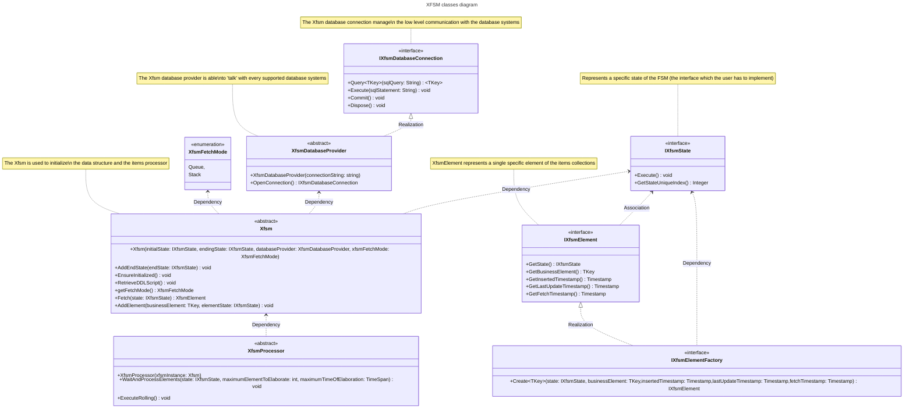

```mermaid
---
title: XFSM classes diagram
---
classDiagram
    Xfsm <.. XfsmProcessor : Dependency
    IXfsmState <.. IXfsmElement : Association
    XfsmFetchMode <.. Xfsm : Dependency
    XfsmDatabaseProvider <.. Xfsm : Dependency
    IXfsmState <.. Xfsm : Dependency
    IXfsmDatabaseConnection <|.. XfsmDatabaseProvider : Realization
    IXfsmElement <|.. IXfsmElementFactory : Realization
    IXfsmState <.. IXfsmElementFactory : Dependency

    note for Xfsm "The Xfsm is used to initialize\n the data structure and the items processor"
    class Xfsm~TKey~ {
        <<abstract>>
        +Xfsm(initialState: IXfsmState, endingState: IXfsmState, databaseProvider: XfsmDatabaseProvider, xfsmFetchMode: XfsmFetchMode)
        +AddEndState(endState: IXfsmState) void
        +EnsureInitialized() void
        +RetrieveDDLScript() void
        +getFetchMode() XfsmFetchMode
        +Fetch(state: IXfsmState) XfsmElement
        +AddElement(businessElement: TKey, elementState: IXfsmState) void
    }

    class XfsmFetchMode {
       <<enumeration>>
       Queue,
       Stack
    }

    note for IXfsmElement "XfsmElement represents a single specific element of the items collections"
    class IXfsmElement~TKey~ {
        <<interface>>
        +GetState() IXfsmState
        +GetBusinessElement() TKey
        +GetInsertedTimestamp() Timestamp
        +GetLastUpdateTimestamp() Timestamp
        +GetFetchTimestamp() Timestamp
    }

    note for XfsmDatabaseProvider "The Xfsm database provider is able\nto 'talk' with every supported database systems"
    class XfsmDatabaseProvider{
        <<abstract>>
        +XfsmDatabaseProvider(connectionString: string)
        +OpenConnection() IXfsmDatabaseConnection
    }

    note for IXfsmDatabaseConnection "The Xfsm database connection manage\n the low level communication with the database systems"
    class IXfsmDatabaseConnection{
        <<interface>>
        +Query~TKey~(sqlQuery: String) ~TKey~
        +Execute(sqlStatement: String) void
        +Commit() void
        +Dispose() void
    }

    class XfsmProcessor {
        <<abstract>>
        +XfsmProcessor(xfsmInstance:  Xfsm)
        +WaitAndProcessElements(state: IXfsmState, maximumElementToElaborate: int, maximumTimeOfElaboration: TimeSpan) void
        +ExecuteRolling() void
    }

    note for IXfsmState "Represents a specific state of the FSM (the interface which the user has to implement)"
    class IXfsmState{
        <<interface>>
        +Execute() void
        +GetStateUniqueIndex() Integer
    }

    class IXfsmElementFactory {
        <<interface>>
        +Create~TKey~(state: IXfsmState, businessElement: TKey,insertedTimestamp: Timestamp,lastUpdateTimestamp: Timestamp,fetchTimestamp: Timestamp) IXfsmElement
    }

```
