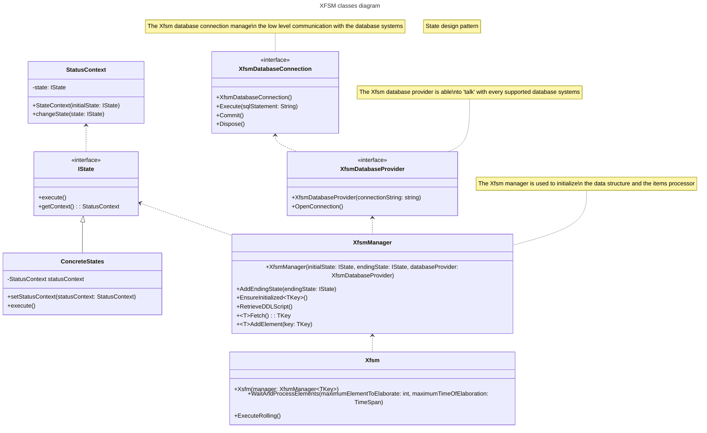

```mermaid
---
title: XFSM classes diagram
---
classDiagram
    XfsmManager <.. Xfsm
    StatusContext <.. IState
    IState <.. XfsmManager
    XfsmDatabaseProvider <.. XfsmManager
    XfsmDatabaseConnection <.. XfsmDatabaseProvider

    note for XfsmManager "The Xfsm manager is used to initialize\n the data structure and the items processor"
    class XfsmManager~TKey~{ 
        +XfsmManager(initialState: IState, endingState: IState, databaseProvider: XfsmDatabaseProvider)
        +AddEndingState(endingState: IState)
        +EnsureInitialized~TKey~()
        +RetrieveDDLScript()
        +~T~Fetch() : TKey
        +~T~AddElement(key: TKey)
    }

    note for XfsmDatabaseProvider "The Xfsm database provider is able\nto 'talk' with every supported database systems"
    class XfsmDatabaseProvider{
        <<interface>>
        +XfsmDatabaseProvider(connectionString: string)
        +OpenConnection()
    }

    note for XfsmDatabaseConnection "The Xfsm database connection manage\n the low level communication with the database systems"
    class XfsmDatabaseConnection{
        <<interface>>
        +XfsmDatabaseConnection()
        +Execute(sqlStatement: String)
        +Commit()
        +Dispose()
    }

    class Xfsm~TKey~{
        +Xsfm(manager:  XfsmManager~TKey~)
        +WaitAndProcessElements(maximumElementToElaborate: int, maximumTimeOfElaboration: TimeSpan)
        +ExecuteRolling()
    }


    note "State design pattern"
    class IState{
        <<interface>>
        +execute()
        +getContext() : StatusContext
    }
    class StatusContext{
        -state: IState
        +StateContext(initialState: IState)
        +changeState(state: IState)
    }
    IState <|-- ConcreteStates
    class ConcreteStates {
        -StatusContext statusContext
        +setStatusContext(statusContext: StatusContext)
        +execute()
    }

```
