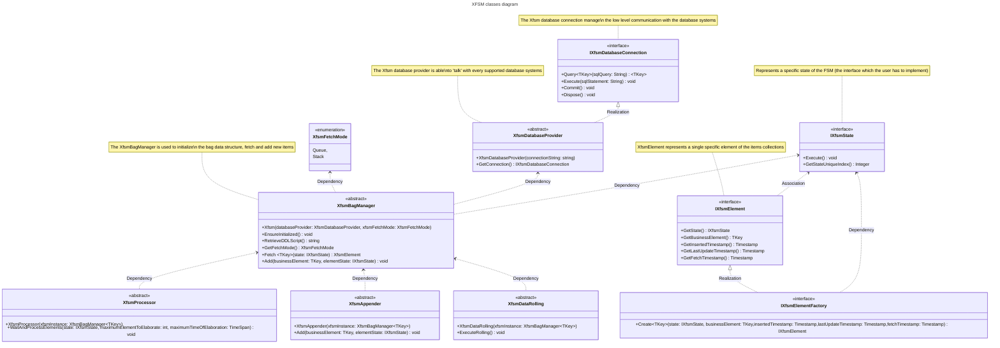

```mermaid
---
title: XFSM classes diagram
---
classDiagram
    XfsmBagManager <.. XfsmProcessor : Dependency
    XfsmBagManager <.. XfsmAppender : Dependency
    XfsmBagManager <.. XfsmDataRolling : Dependency
    IXfsmState <.. IXfsmElement : Association
    XfsmFetchMode <.. XfsmBagManager : Dependency
    XfsmDatabaseProvider <.. XfsmBagManager : Dependency
    IXfsmState <.. XfsmBagManager : Dependency
    IXfsmDatabaseConnection <|.. XfsmDatabaseProvider : Realization
    IXfsmElement <|.. IXfsmElementFactory : Realization
    IXfsmState <.. IXfsmElementFactory : Dependency

    note for XfsmBagManager "The XfsmBagManager is used to initialize\n the bag data structure, fetch and add new items"
    class XfsmBagManager~TKey~ {
        <<abstract>>
        +Xfsm(databaseProvider: XfsmDatabaseProvider, xfsmFetchMode: XfsmFetchMode)
        +EnsureInitialized() void
        +RetrieveDDLScript() string
        +GetFetchMode() XfsmFetchMode
        +Fetch ~TKey~(state: IXfsmState) XfsmElement
        +Add(businessElement: TKey, elementState: IXfsmState) void
    }

    class XfsmFetchMode {
       <<enumeration>>
       Queue,
       Stack
    }

    note for IXfsmElement "XfsmElement represents a single specific element of the items collections"
    class IXfsmElement~TKey~ {
        <<interface>>
        +GetState() IXfsmState
        +GetBusinessElement() TKey
        +GetInsertedTimestamp() Timestamp
        +GetLastUpdateTimestamp() Timestamp
        +GetFetchTimestamp() Timestamp
    }

    note for XfsmDatabaseProvider "The Xfsm database provider is able\nto 'talk' with every supported database systems"
    class XfsmDatabaseProvider{
        <<abstract>>
        +XfsmDatabaseProvider(connectionString: string)
        +GetConnection() IXfsmDatabaseConnection
    }

    note for IXfsmDatabaseConnection "The Xfsm database connection manage\n the low level communication with the database systems"
    class IXfsmDatabaseConnection{
        <<interface>>
        +Query~TKey~(sqlQuery: String) ~TKey~
        +Execute(sqlStatement: String) void
        +Commit() void
        +Dispose() void
    }

    class XfsmProcessor ~TKey~ {
        <<abstract>>
        +XfsmProcessor(xfsmInstance:  XfsmBagManager~TKey~)
        +WaitAndProcessElements(state: IXfsmState, maximumElementToElaborate: int, maximumTimeOfElaboration: TimeSpan) void
    }

    class XfsmAppender ~TKey~ {
        <<abstract>>
        +XfsmAppender(xfsmInstance:  XfsmBagManager~TKey~)
        +Add(businessElement: TKey, elementState: IXfsmState) void
    }

    class XfsmDataRolling ~TKey~ {
        <<abstract>>
        +XfsmDataRolling(xfsmInstance:  XfsmBagManager~TKey~)
        +ExecuteRolling() void
    }

    note for IXfsmState "Represents a specific state of the FSM (the interface which the user has to implement)"
    class IXfsmState{
        <<interface>>
        +Execute() void
        +GetStateUniqueIndex() Integer
    }

    class IXfsmElementFactory {
        <<interface>>
        +Create~TKey~(state: IXfsmState, businessElement: TKey,insertedTimestamp: Timestamp,lastUpdateTimestamp: Timestamp,fetchTimestamp: Timestamp) IXfsmElement
    }

```
