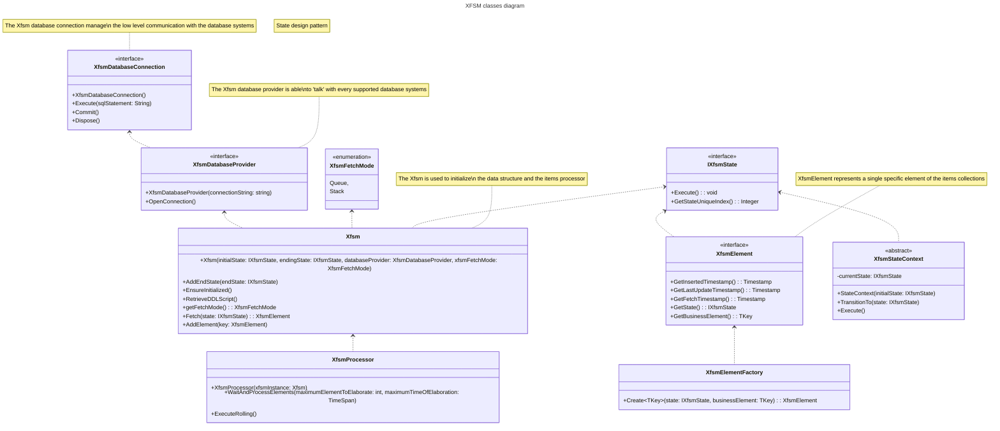

```mermaid
---
title: XFSM classes diagram
---
classDiagram
    Xfsm <.. XfsmProcessor
    IXfsmState <.. Xfsm
    IXfsmState <.. XfsmElement
    IXfsmState <.. XfsmStateContext
    XfsmFetchMode <.. Xfsm
    XfsmDatabaseProvider <.. Xfsm
    XfsmDatabaseConnection <.. XfsmDatabaseProvider
    XfsmElement <.. XfsmElementFactory

    note for Xfsm "The Xfsm is used to initialize\n the data structure and the items processor"
    class Xfsm{ 
        +Xfsm(initialState: IXfsmState, endingState: IXfsmState, databaseProvider: XfsmDatabaseProvider, xfsmFetchMode: XfsmFetchMode)
        +AddEndState(endState: IXfsmState)
        +EnsureInitialized()
        +RetrieveDDLScript()
        +getFetchMode() : XfsmFetchMode
        +Fetch(state: IXfsmState) : XfsmElement
        +AddElement(key: XfsmElement)
    }

    class XfsmFetchMode {
       <<enumeration>>
       Queue,
       Stack
    }

    note for XfsmElement "XfsmElement represents a single specific element of the items collections"
    class XfsmElement~TKey~ {
        <<interface>>
        +GetInsertedTimestamp(): Timestamp
        +GetLastUpdateTimestamp(): Timestamp
        +GetFetchTimestamp(): Timestamp
        +GetState() : IXfsmState
        +GetBusinessElement(): TKey
    }

    note for XfsmDatabaseProvider "The Xfsm database provider is able\nto 'talk' with every supported database systems"
    class XfsmDatabaseProvider{
        <<interface>>
        +XfsmDatabaseProvider(connectionString: string)
        +OpenConnection()
    }

    note for XfsmDatabaseConnection "The Xfsm database connection manage\n the low level communication with the database systems"
    class XfsmDatabaseConnection{
        <<interface>>
        +XfsmDatabaseConnection()
        +Execute(sqlStatement: String)
        +Commit()
        +Dispose()
    }

    class XfsmProcessor{
        +XfsmProcessor(xfsmInstance:  Xfsm)
        +WaitAndProcessElements(maximumElementToElaborate: int, maximumTimeOfElaboration: TimeSpan)
        +ExecuteRolling()
    }

    note "State design pattern"
    class IXfsmState{
        <<interface>>
        +Execute() : void
        +GetStateUniqueIndex(): Integer
    }

    class XfsmStateContext{
        <<abstract>>
        -currentState: IXfsmState
        +StateContext(initialState: IXfsmState)
        +TransitionTo(state: IXfsmState)
        +Execute()
    }

    class XfsmElementFactory {
        +Create~TKey~(state: IXfsmState, businessElement: TKey): XfsmElement
    }

```
