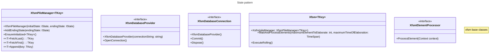

```mermaid
---
title: State pattern
---
classDiagram
    note "xfsm base classes"
    class XfsmPileManager~TKey~{ 
        +XfsmPileManager(initialState: IState, endingState: IState)
        +AddEndingState(endingState: IState)
        +EnsureInitialized~TKey~()
        +~T~FetchLast() : TKey
        +~T~FetchFirst() : TKey
        +~T~Append(key: TKey)
    }

    class XfsmDatabaseProvider{
        <<interface>>
        +XfsmDatabaseProvider(connectionString: string)
        +OpenConnection()
    }

    class XfsmDatabaseConnection{
        <<interface>>
        +XfsmDatabaseProvider()
        +Commit()
        +Dispose()
    }

    class Xfsm~TKey~{
        +Xsfm(pileManager:  XfsmPileManager~TKey~)
        +WaitAndProcessElements(maximumElementToElaborate: int, maximumTimeOfElaboration: TimeSpan)
        +ExecuteRolling()
    }

    class XfsmElementProcessor{
        <<interface>>
        +ProcessElement(Context context)
    }

```
