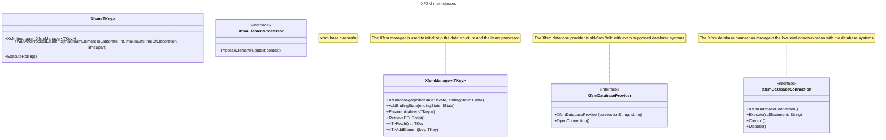

```mermaid
---
title: XFSM main classes
---
classDiagram
    note "xfsm base classes\n"
    note for XfsmManager "The Xfsm manager is used to initialize\n the data structure and the items processor"
    class XfsmManager~TKey~{ 
        +XfsmManager(initialState: IState, endingState: IState)
        +AddEndingState(endingState: IState)
        +EnsureInitialized~TKey~()
        +RetrieveDDLScript()
        +~T~Fetch() : TKey
        +~T~AddElement(key: TKey)
    }

    note for XfsmDatabaseProvider "The Xfsm database provider is able\nto 'talk' with every supported database systems"
    class XfsmDatabaseProvider{
        <<interface>>
        +XfsmDatabaseProvider(connectionString: string)
        +OpenConnection()
    }

    note for XfsmDatabaseConnection "The Xfsm database connection manage\n the low level communication with the database systems"
    class XfsmDatabaseConnection{
        <<interface>>
        +XfsmDatabaseConnection()
        +Execute(sqlStatement: String)
        +Commit()
        +Dispose()
    }

    class Xfsm~TKey~{
        +Xsfm(manager:  XfsmManager~TKey~)
        +WaitAndProcessElements(maximumElementToElaborate: int, maximumTimeOfElaboration: TimeSpan)
        +ExecuteRolling()
    }

    class XfsmElementProcessor{
        <<interface>>
        +ProcessElement(Context context)
    }

```
