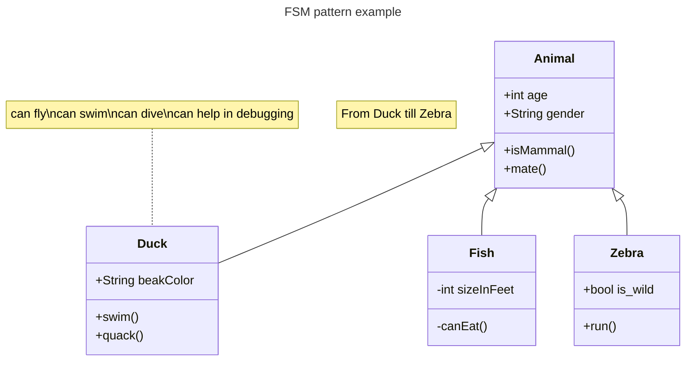
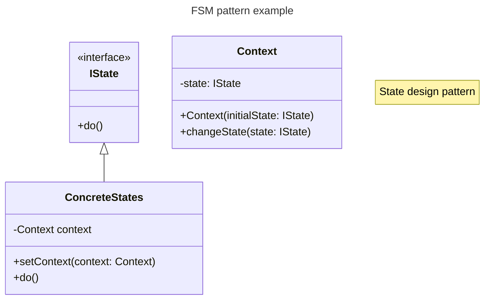

```mermaid
---
title: FSM pattern example
---
classDiagram
    note "From Duck till Zebra"
    Animal <|-- Duck
    note for Duck "can fly\ncan swim\ncan dive\ncan help in debugging"
    Animal <|-- Fish
    Animal <|-- Zebra
    Animal : +int age
    Animal : +String gender
    Animal: +isMammal()
    Animal: +mate()
    class Duck{
        +String beakColor
        +swim()
        +quack()
    }
    class Fish{
        -int sizeInFeet
        -canEat()
    }
    class Zebra{
        +bool is_wild
        +run()
    }
```

```mermaid
---
title: FSM pattern example
---
classDiagram
    note "State design pattern"
    class IState{
        <<interface>>
        +do()
    }
    class Context{
        -state: IState
        +Context(initialState: IState)
        +changeState(state: IState)
    }
    IState <|-- ConcreteStates
    class ConcreteStates{
        -Context context
        +setContext(context: Context)
        +do()
    }
```
